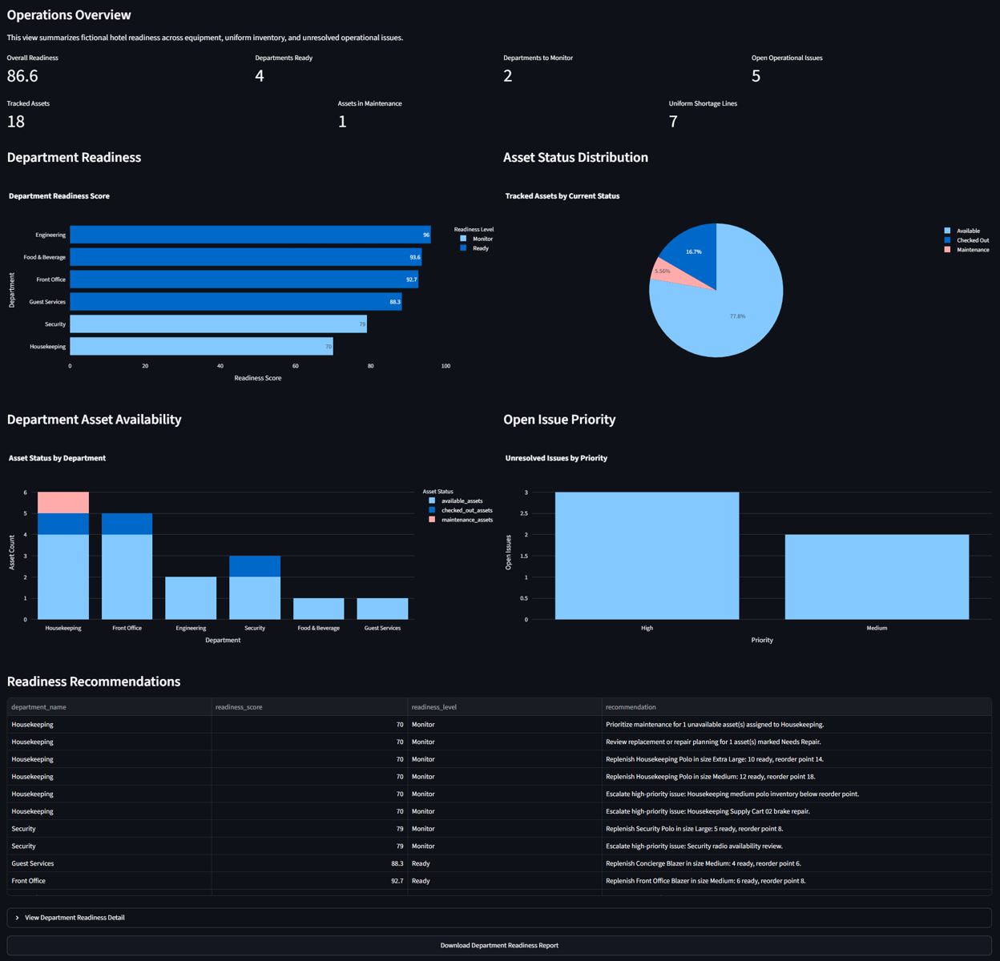
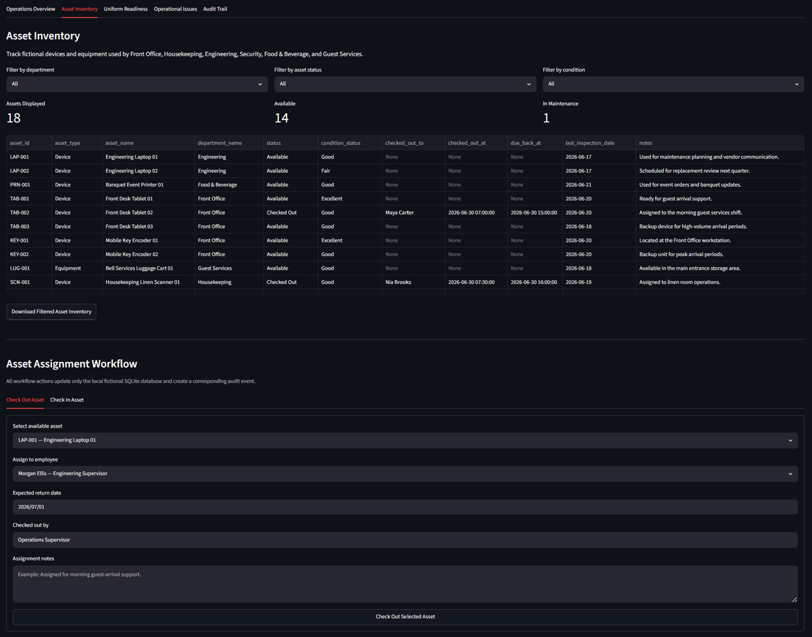
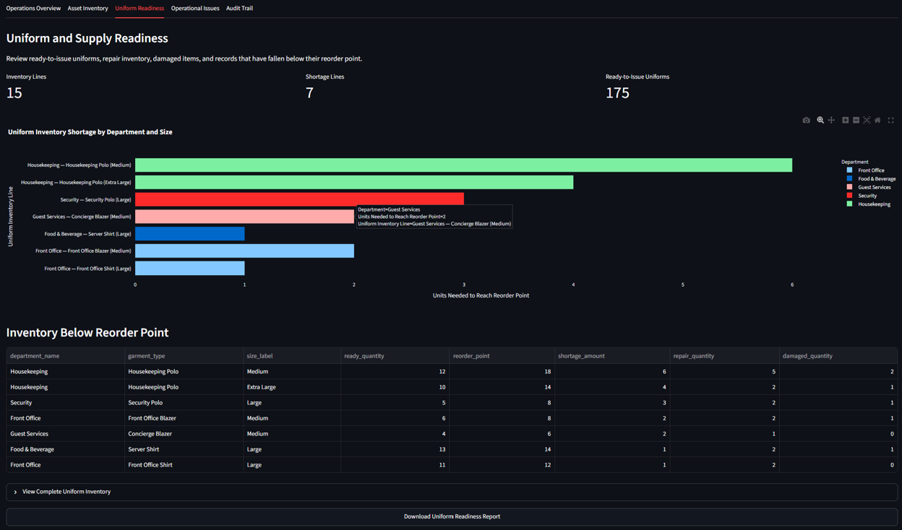
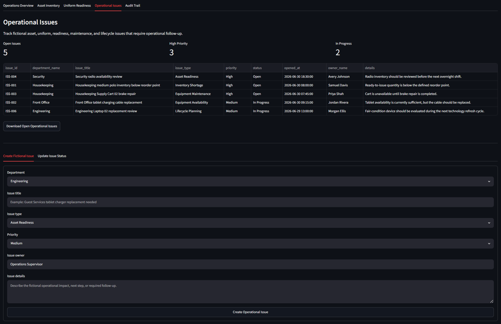
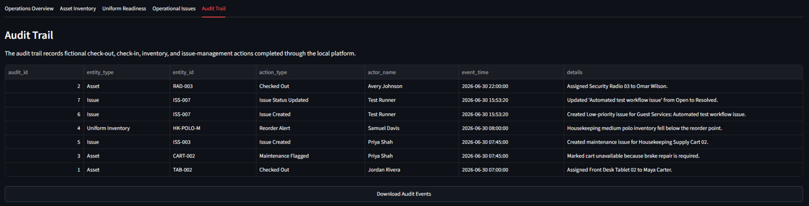

# Hospitality Asset Readiness Platform

A fictional SQLite-backed hospitality operations platform for tracking shared assets, uniform readiness, operational issues, department-level readiness, and audit events.

Built as a portfolio project for hospitality operations, business systems, digital transformation, business analysis, technology management, IT operations, and product-oriented roles.

> **Portfolio Scope:** All employee names, departments, assets, inventory records, issues, and operational scenarios in this project are fictional. This application does not use, represent, or disclose proprietary hotel, employee, guest, or company data.

## Project Highlights

- Tracks fictional hotel devices, equipment, uniforms, operational issues, and audit events.
- Uses a local SQLite database to simulate a practical internal operations system.
- Calculates transparent department-readiness scores from asset, uniform, and issue data.
- Supports asset check-out and check-in workflows.
- Records asset condition during check-in.
- Moves returned assets marked **Needs Repair** into Maintenance status.
- Identifies uniform inventory lines below their defined reorder point.
- Supports creation and status updates for fictional operational issues.
- Creates an audit trail for workflow actions.
- Includes interactive Streamlit dashboards, filters, charts, tables, and CSV exports.
- Includes automated tests that use isolated temporary databases.

## Technology Stack

| Category | Tools |
|---|---|
| Programming Language | Python |
| Application Framework | Streamlit |
| Database | SQLite |
| Data Processing | Pandas |
| Visualization | Plotly |
| Testing | Pytest |
| Version Control | Git and GitHub |
| Development Environment | VS Code |

## Business Scenario

Hotel operations teams rely on a wide range of physical assets and supplies to support staff readiness and consistent guest service.

Examples include:

- Front-desk tablets
- Mobile key encoders
- Security radios
- Housekeeping scanners
- Supply carts
- Engineering laptops
- Banquet printers
- Vacuums
- Luggage carts
- Department-specific uniforms

This platform demonstrates how an internal operations team could monitor whether departments have sufficient operational assets, ready-to-issue uniforms, and resolved operational issues before the next shift or service period.

## Platform Workflow

```text
Fictional operational data
            ↓
SQLite database
            ↓
Asset, uniform, issue, and audit records
            ↓
Rule-based readiness engine
            ↓
Department readiness scores and recommendations
            ↓
Interactive Streamlit dashboard and CSV exports
```

## Dashboard Features

### Operations Overview

The **Operations Overview** tab provides a portfolio-level view of fictional hotel readiness.

It includes:

- Overall readiness score
- Number of departments classified as Ready
- Number of departments requiring monitoring
- Open operational issue count
- Tracked asset count
- Assets currently in Maintenance
- Uniform shortage-line count
- Department-readiness comparison chart
- Asset-status distribution chart
- Department asset-availability chart
- Open-issue priority chart
- Rule-based readiness recommendations
- Downloadable department-readiness report

### Asset Inventory

The **Asset Inventory** tab supports practical operational asset tracking.

It includes:

- Department, asset-status, and condition filters
- Asset inventory table
- Assigned employee information for checked-out assets
- Last inspection date and asset notes
- Downloadable filtered asset inventory
- Asset check-out workflow
- Asset check-in workflow
- Return-condition updates
- Automatic Maintenance status for assets returned as **Needs Repair**

### Uniform and Supply Readiness

The **Uniform Readiness** tab identifies inventory conditions that may affect staff readiness.

It includes:

- Ready-to-issue uniform totals
- Uniform inventory-line count
- Inventory shortage-line count
- Uniform shortage chart by department, garment type, and size
- Inventory-below-reorder table
- Repair and damaged inventory visibility
- Downloadable uniform-readiness report

### Operational Issues

The **Operational Issues** tab tracks fictional operational follow-up items.

It includes:

- Open issue count
- High-priority issue count
- In-progress issue count
- Issue ownership and department visibility
- Create-fictional-issue workflow
- Issue-status update workflow
- Downloadable open-issues report

### Audit Trail

The **Audit Trail** tab records fictional workflow events such as:

- Asset check-outs
- Asset check-ins
- Maintenance flags
- Uniform reorder alerts
- Issue creation
- Issue-status updates

The audit table can also be downloaded as a CSV file.

## Transparent Readiness Model

Each department receives a readiness score from `0` to `100`.

| Component | Weight | What It Measures |
|---|---:|---|
| Asset readiness | 40% | Asset availability, maintenance status, and recorded condition |
| Uniform readiness | 30% | Reorder shortages, repair inventory, and damaged items |
| Issue readiness | 30% | Unresolved operational issues weighted by priority |

### Readiness Levels

| Readiness Level | Score Range | Meaning |
|---|---:|---|
| Ready | 85–100 | Department has strong operational readiness under the fictional model |
| Monitor | 70–84.9 | Department has manageable conditions requiring ongoing review |
| At Risk | 50–69.9 | Department has material readiness concerns |
| Needs Attention | Below 50 | Department requires immediate operational follow-up |

### Scoring Principles

The readiness model is intentionally transparent:

- **Available** and **Checked Out** assets are considered operational because checked-out items are actively supporting staff workflows.
- Assets in **Maintenance** or **Retired** status reduce asset readiness.
- Assets in **Fair** or **Needs Repair** condition apply additional condition penalties.
- Uniform inventory below its reorder point reduces uniform readiness.
- Repair and damaged uniform quantities also affect uniform readiness.
- Open issues reduce issue readiness based on priority.
- Issues marked **In Progress** receive a smaller penalty than issues still marked **Open**.

> This scoring model is educational and illustrative. It is not intended to replace hotel policy, safety requirements, staffing decisions, procurement rules, or management judgment.

## Fictional Data Included

The seed dataset includes fictional records for the following departments:

- Front Office
- Housekeeping
- Food & Beverage
- Engineering
- Security
- Guest Services

The seeded database includes:

| Record Type | Count |
|---|---:|
| Departments | 6 |
| Employees | 12 |
| Assets | 18 |
| Asset assignments | 4 |
| Uniform inventory lines | 15 |
| Operational issues | 6 |
| Audit events | 5 |

The default scenario includes:

- 3 active asset assignments
- 5 unresolved operational issues
- 7 uniform shortage lines
- 1 asset in Maintenance

## Project Structure

```text
hospitality-asset-readiness-platform
├── app.py
├── requirements.txt
├── README.md
├── .gitignore
├── data
│   └── seed_data.py
├── database
│   └── .gitkeep
├── docs
│   └── images
│       ├── 4-passed-tests.png
│       ├── asset-inventory.png
│       ├── audit-trail.png
│       ├── operations-overview.png
│       ├── operational-issues.png
│       └── uniform-readiness.png
├── figures
│   └── .gitkeep
├── output
│   └── .gitkeep
├── src
│   ├── __init__.py
│   ├── analytics.py
│   ├── asset_service.py
│   ├── database.py
│   └── readiness_engine.py
└── tests
    └── test_readiness_engine.py
```

## Local Setup

### Prerequisites

- Python 3.10 or later
- Git
- VS Code or another Python IDE

### Clone the Repository

```bash
git clone https://github.com/zhetheru/hospitality-asset-readiness-platform.git
cd hospitality-asset-readiness-platform
```

### Create and Activate a Virtual Environment

```bat
python -m venv .venv
.\.venv\Scripts\activate
```

### Install Dependencies

```bat
.\.venv\Scripts\python.exe -m pip install --upgrade pip
.\.venv\Scripts\python.exe -m pip install -r requirements.txt
```

### Create the Fictional SQLite Database

The local database file is excluded from Git. Recreate it with the seed script:

```bat
.\.venv\Scripts\python.exe data\seed_data.py
```

Expected confirmation:

```text
Fictional hospitality asset database created successfully.
```

### Run the Application

```bat
.\.venv\Scripts\python.exe -m streamlit run app.py
```

Then open the local address shown in the terminal, typically:

```text
http://localhost:8501
```

## Run Automated Tests

Run the test suite with:

```bat
.\.venv\Scripts\python.exe -m pytest -v
```

The automated tests verify:

- Expected readiness metrics from the fictional seed data
- Uniform-shortage detection
- Asset check-out workflow
- Asset check-in workflow
- Asset status and condition updates
- Operational-issue creation
- Operational-issue resolution

The tests use isolated temporary SQLite databases, so they do not modify or lock the local database used by the Streamlit application.

## Screenshots

### Operations Overview

The Operations Overview tab summarizes fictional hotel readiness across department assets, uniforms, and unresolved issues. It includes metrics, charts, readiness recommendations, and a downloadable readiness report.



### Asset Inventory

The Asset Inventory tab supports asset tracking, filtering, check-out, check-in, return-condition updates, and inventory exports.



### Uniform Readiness

The Uniform Readiness tab identifies uniform inventory below reorder targets and displays readiness signals by department, garment type, and size.



### Operational Issues

The Operational Issues tab tracks fictional open issues and includes workflows for creating issues and updating issue status.



### Audit Trail

The Audit Trail records fictional workflow events, including asset assignments, maintenance flags, inventory alerts, and issue-management updates.



### Automated Tests

The test suite confirms readiness scoring, uniform-shortage detection, asset workflows, and issue-management workflows.


## Key Implementation Notes

### Local SQLite Database

The application uses a local SQLite database because it is lightweight, easy to reproduce, and appropriate for a portfolio-scale operational system.

The generated database file is ignored through `.gitignore`:

```text
database/*.db
database/*.sqlite
database/*.sqlite3
```

This keeps generated local data out of the repository while allowing users to recreate the fictional dataset with `data/seed_data.py`.

### Auditable Workflow Actions

Asset and issue actions update the local SQLite database and write audit events. This demonstrates a basic operational-control concept: important status changes should be traceable.

### Rule-Based Decision Support

The platform uses transparent rules rather than opaque AI predictions. This makes the scoring logic explainable and easier to discuss with operations leaders, technical stakeholders, and risk-management teams.

## Future Enhancements

Potential future improvements include:

- User authentication and role-based permissions
- Employee shift-scheduling integration
- Barcode or QR-code asset scanning
- Asset-maintenance due-date alerts
- Reorder-request approval workflow
- Purchase-order tracking
- Asset lifecycle and replacement-cost forecasting
- Department-specific readiness targets
- Email or Teams-style escalation notifications
- Historical readiness-score trend analysis
- Cloud database deployment
- REST API integration with inventory or property-management systems
- Mobile-first check-out and check-in interface

## Portfolio Relevance

This project demonstrates practical experience with:

- Hospitality operations workflows
- Business systems analysis
- Digital transformation concepts
- Python application development
- SQLite database design
- Data modeling and seed-data generation
- Streamlit application development
- Rule-based decision support
- Inventory and asset-management workflows
- Audit logging
- Operational readiness analysis
- Interactive data visualization with Plotly
- CSV export workflows
- Automated testing with Pytest
- GitHub documentation

## Author

**Zarita Hetheru**  
GitHub: [@zhetheru](https://github.com/zhetheru)